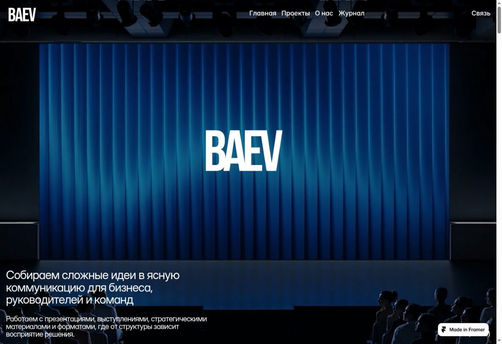
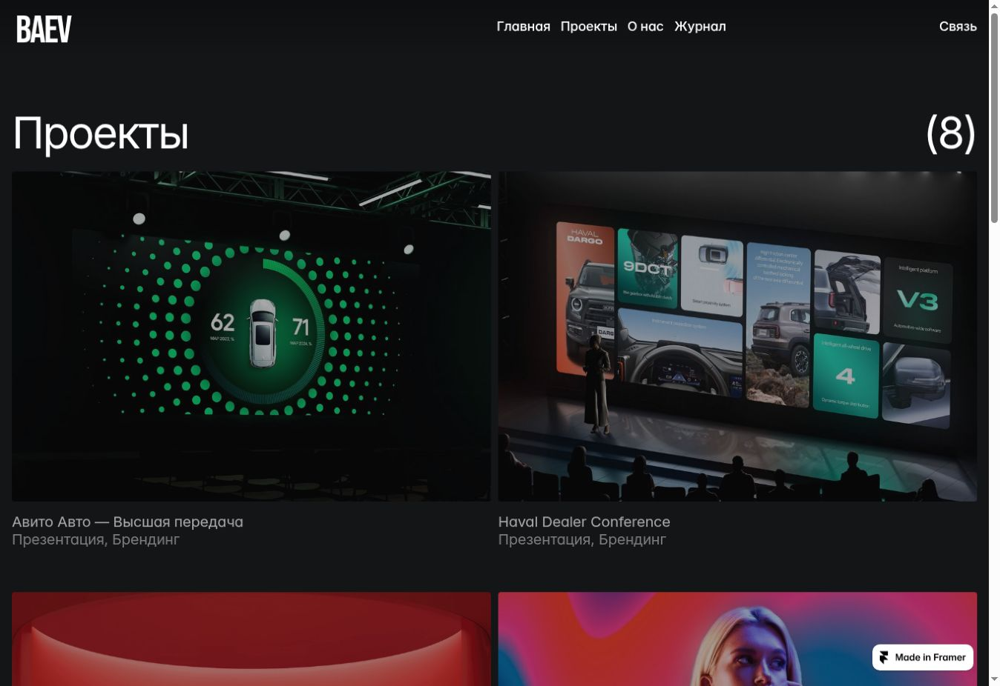
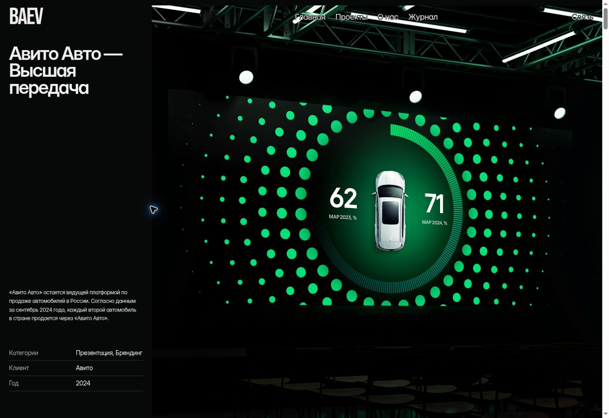
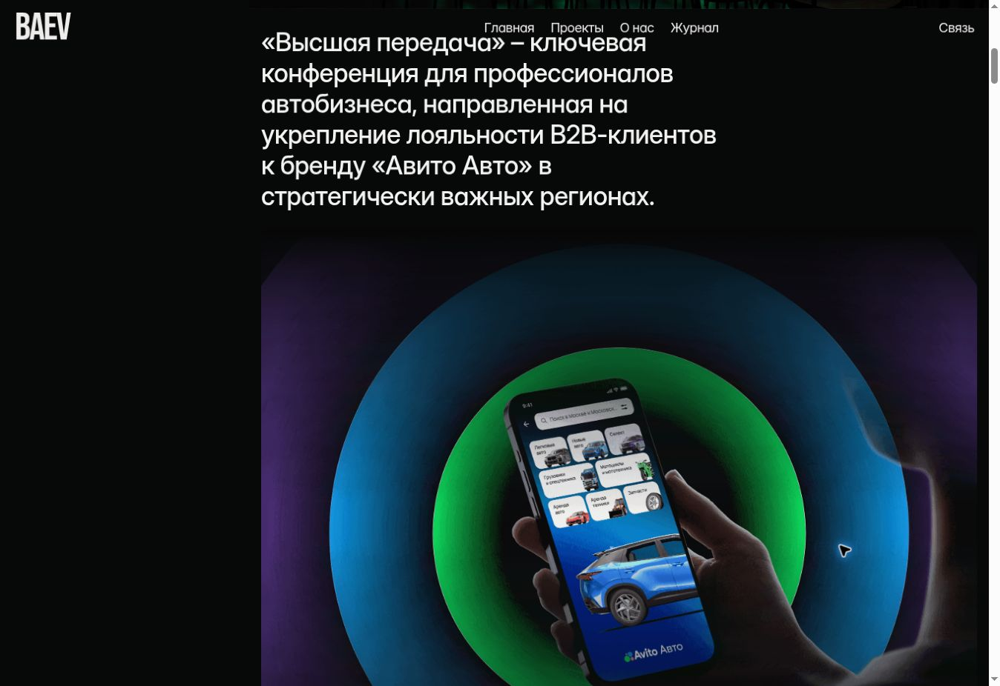
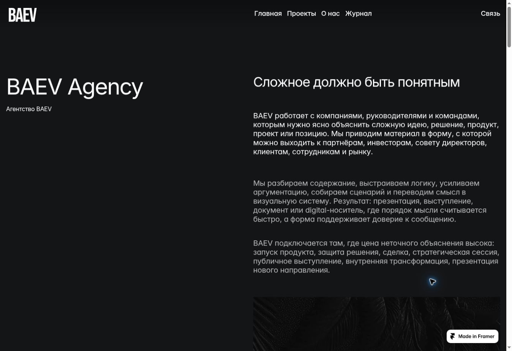
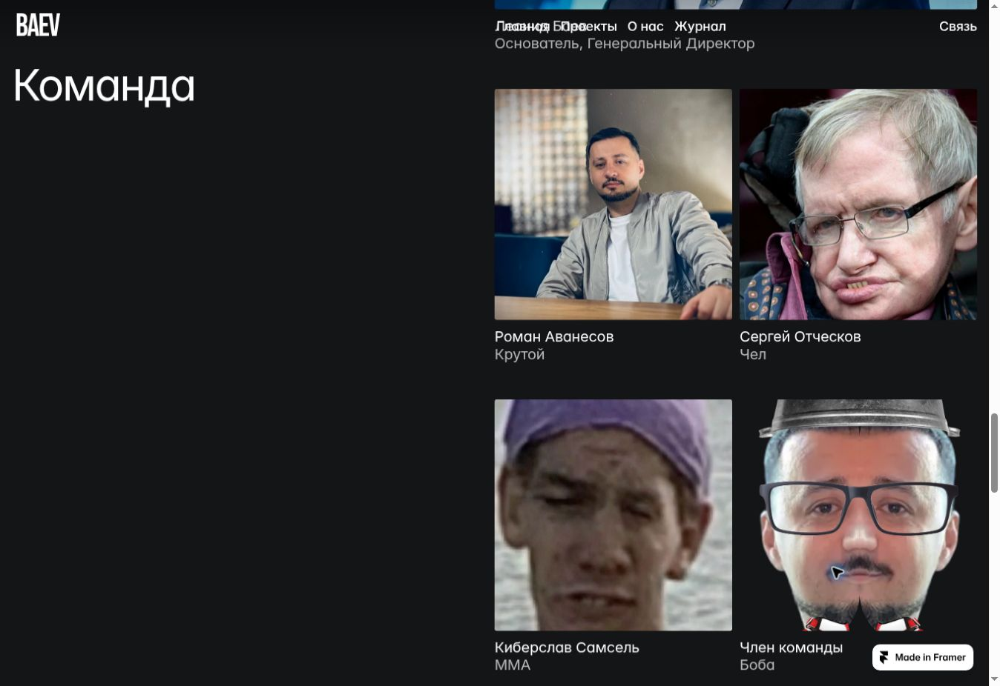
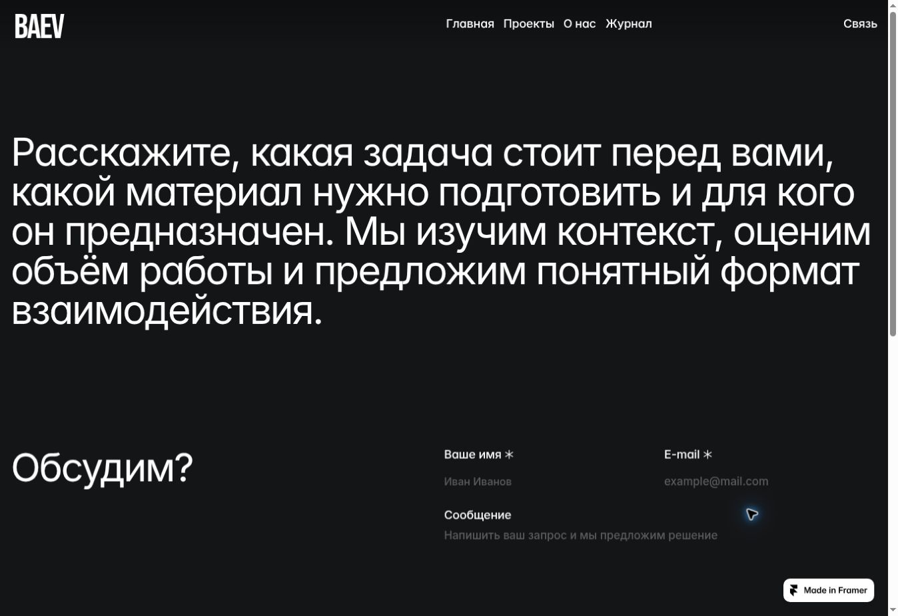
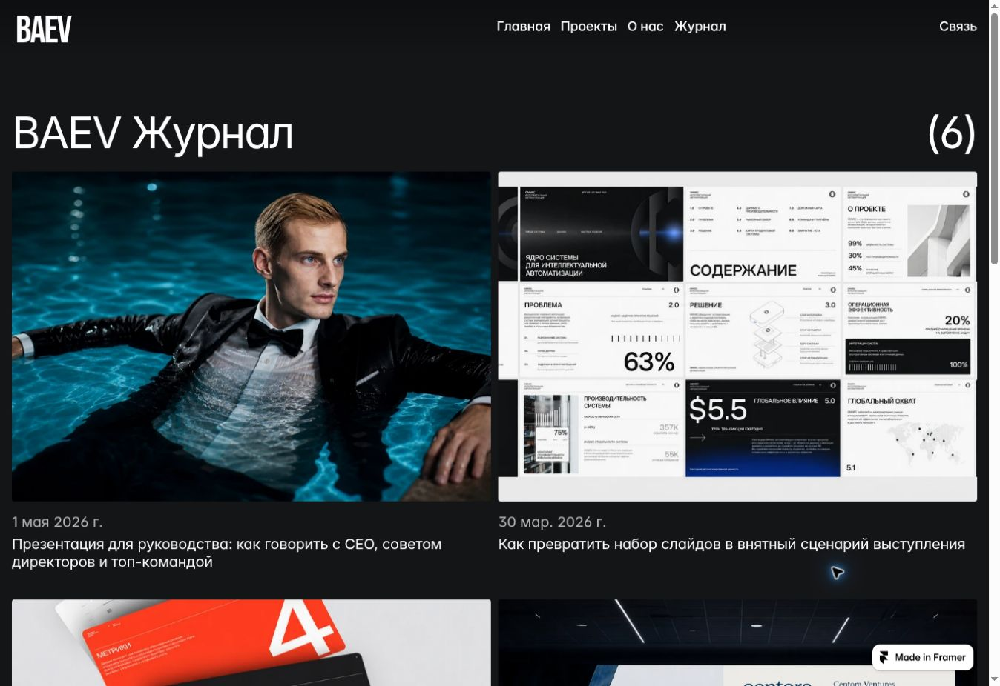
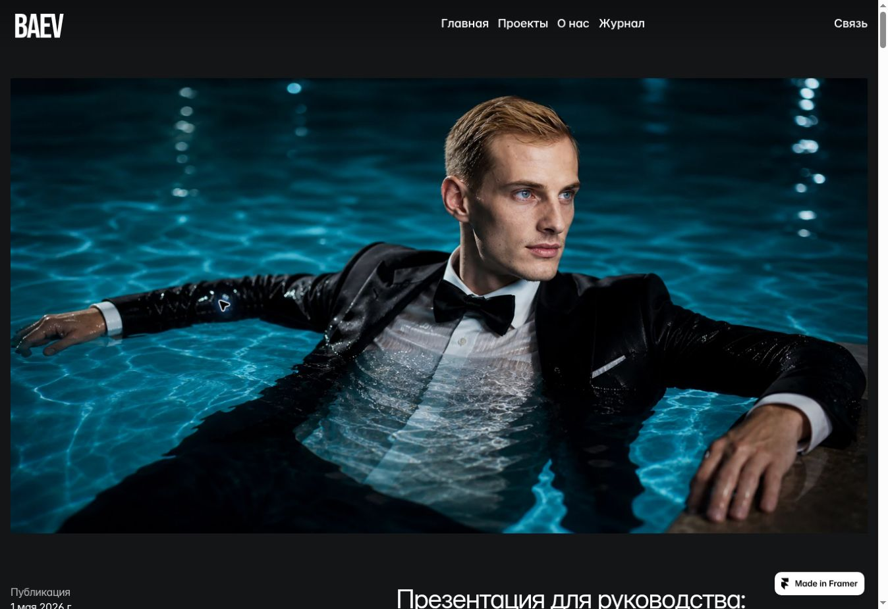
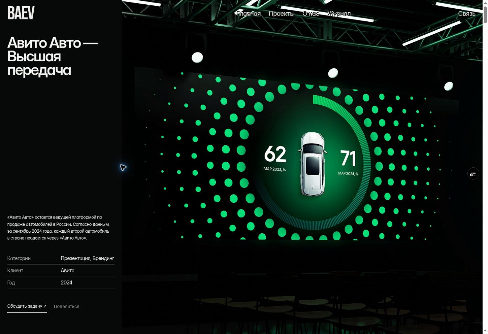

# BAEV: публичный сайт, кейсы и следующий этап роста

## 01. Вывод и направление

Аудит от 4 октября 2026 года. Сайт: https://baev-case-lab.vercel.app/.

У BAEV уже есть сильный исходный материал: узнаваемые клиенты, масштабные изображения, выразительная типографика, тёмная среда и характерная композиция кейса с информацией слева. Основную визуальную идею стоит сохранить. Слабое место сейчас - согласованность всей системы: часть контента выглядит незавершённой, отдельные ссылки ошибочны, описания не всегда объясняют вклад агентства, а разные разделы обновляются из разных источников.

Главная задача следующего этапа: превратить впечатляющую витрину в убедительное доказательство компетенции. Посетитель должен быстро понять, какую задачу вы решаете, увидеть близкий ему пример, оценить качество мышления команды и легко начать разговор.

Красивые работы уже создают внимание. Ясная специализация, доказательный кейс и безошибочный путь к контакту должны превращать это внимание в доверие. Сейчас дополнительная анимация принесёт меньше пользы, чем исправление этих трёх вещей.

**Что сохраняем:** крупный масштаб, чёрно-белый интерфейс, цвет только в самих работах, большую обложку, длинную визуальную историю и самостоятельный характер BAEV. Первый экран кейса занимает всю правую часть окна без скругления и внутренних полей. Настройки отступов и радиуса относятся только к телу кейса.

**Что меняем:** случайные решения, шаблонные тексты, неодинаковые маршруты, шум в редакторе и отсутствие единой модели публикации. Минимализм здесь означает меньшую нагрузку на человека при сохранении полезной информации.

## 02. Основание аудита и границы выводов

Проверены живые страницы на настольном экране: главная, каталог работ, кейс Авито (обложка и прокрутка тела), страница агентства и блок команды, контакты, журнал, статья о презентации для руководства. Сохранены девять исходных скриншотов. Дополнительно проверены HTML/DOM, пути ссылок, код интеграции формы, публичный рендер кейса и архитектура CMS.

Три карточки журнала проверены отдельно: /blog/pitch-deck-2026-ai, /blog/sales-deck-how и /blog/why-your-presentation-isnt-persuasive возвращали 404. Это подтверждённые ошибки, а не предположение по внешнему виду.

Исходные скриншоты фиксируют состояние ДО текущих исправлений. Раздел 04 описывает внесённые изменения; остальные пункты помечены как следующие задачи. Оценки приоритета - экспертные: аналитика посещений, конверсия, записи пользовательских сессий и интервью в этот аудит не входили.

Это не сертификат соответствия WCAG и не измерение Core Web Vitals в реальном трафике. Полноценная проверка на физических телефонах, Safari, скринридере и медленной сети остаётся в плане. Рабочую форму не отправляли: поведение при ошибке и повторной отправке проверено изолированно, без создания тестовых лидов в CRM.

Аудит не переписывает реальные достижения агентства. Любые результаты, сроки, состав команды, отзывы и цифры должны подтверждаться владельцами проектов.

### Карта проверенного пути

| Этап | Состояние до исправлений | Основная причина |
|---|---|---|
| Первое впечатление | Сильная основа, требуется ясность | Масштаб и видео работают; конкретный следующий шаг выражен слабо |
| Выбор проекта | Требует доработки | На главной часть строк вела в чужие кейсы; данные неоднородны |
| Первый экран кейса | Ошибка геометрии | Общие настройки тела затрагивали обложку |
| Чтение кейса | Требует доработки | Левая колонка исчезала; есть длинные общие абзацы и повторы |
| Проверка команды | Критическая проблема доверия | Видны тестовые подписи и изображения |
| Начало общения | Работает в коде, UX требует улучшения | Форма связана с CRM, но поздно появляется и слабо объясняет состояния |
| Выбор статьи | Критическая ошибка маршрутов | Три карточки из шести вели на отсутствующие страницы |
| Чтение статьи | Требует редакторской работы | В заголовке FreeLab, очень большой визуальный вход, слабая структура |
| Публикация контента | Ограничение масштабирования | Публичный экспорт и CMS существуют параллельно |
| Мобильность и доступность | Частично проверено | Нужен отдельный проход на устройствах и с клавиатурой/скринридером |

## 03. Для кого должен работать сайт

Ниже - рабочие гипотезы об аудитории на основе текущего позиционирования. Их нужно подтвердить на клиентах и в CRM.

**Маркетинг, бренд и коммуникации.** Человек ищет сильную команду для запуска, конференции, публичной коммуникации или визуальной системы. Ему нужны близкие примеры, понятная роль BAEV, масштаб исполнения и понимание процесса. Основной путь: главная - подходящий кейс - обсуждение задачи.

**Руководитель или команда руководителя.** Человек готовит стратегическую сессию, защиту решения, выступление или важную презентацию. Он ищет ясность мысли, деликатность работы со сложным содержанием и уверенность в исполнении. Ему полезнее разбор нескольких конкретных решений, чем длинный перечень эффектов.

**Партнёр или продюсер.** Нужно быстро оценить, подходит ли BAEV для совместной работы, какие функции берёт на себя и что передаёт на выходе. Помогут список компетенций с примерами, роли в кейсах и понятный канал контакта.

**Повторный посетитель.** Он уже знает агентство и ищет конкретный проект, статью или контакт. Для него важны стабильные адреса, быстрые страницы, предсказуемая навигация и отсутствие обязательного шоу перед доступом к информации.

Рекомендация: на главной говорить об общей ценности, а в проектах и услугах давать несколько чётких входов по задачам. Не заставлять все четыре сценария проходить одну длинную презентацию агентства.

## 04. Пять проходов, внесённых в этот релиз

**1. Обложка.** Первый caseHero защищён от общих отступов и радиуса. На компьютере он заполняет правую колонку на высоту окна. В Studio у него остаётся замена изображения или видео; действия перестановки, копирования и удаления скрыты. На телефоне обложка идёт перед информацией о проекте. Общие настройки тела продолжают работать.

**2. Внешний кейс.** Добавлен режим «Внешний кейс - iframe». В нём сохраняются наша обложка и левая информация. Под обложкой выводится внешняя страница на всю ширину тела. Обычные блоки остаются в записи и возвращаются при переключении режима. Есть высота для компьютера и телефона, необязательный код автоматической высоты, проверка URL и ссылка на оригинал при невозможности встраивания.

**3. Чтение и переход к контакту.** Исправлена причина исчезновения закреплённой левой колонки. Добавлены обсуждение задачи из кейса, передача названия проекта в форму, копирование/отправка ссылки и следующий шаг в конце. Мобильное меню получает управление фокусом и закрытие по Escape. Добавлена ссылка пропуска навигации.

**4. Медиа.** Обложка загружается приоритетно; последующие изображения - отложенно. Для адаптивной загрузки используются варианты с сохранением пропорций композиции. Видео в кейсах получают паузу, учитывают уменьшение движения, останавливаются вне видимой области и при скрытой вкладке. Это относится к новому рендеру кейсов; старое видео на главной требует отдельного перевода на общую систему.

**5. Гигиена публичного сайта.** Исправлены перепутанные ссылки Haval, Альфа и Спортмастер в индексе на главной. Скрыты неподтверждённые карточки команды и телефон-заглушка. Исправлены названия страниц и FreeLab в метаданных доступных статей. Карточки трёх отсутствующих статей временно исключены из показа; сами статьи ещё необходимо восстановить или написать. Из видимого текста доступных статей убран служебный список ключевых запросов. Форма получила валидацию, постоянное сообщение о результате, ограничение времени ожидания, защиту от повторного нажатия и сохранение текста при ошибке.

Проверки реализации: 73 интеграционных теста в 17 наборах, TypeScript, производственная сборка и цепочка семи миграций Postgres в изолированной базе. Существующее содержимое опубликованных кейсов не перезаписывалось. Эти проверки подтверждают кодовые сценарии; качество каждого реального внешнего iframe проверяется после добавления его адреса.

## 05. Подробный разбор публичных страниц

Приоритеты: **P0** - ошибка или прямой ущерб доверию; **P1** - ключевой путь к пониманию и обращению; **P2** - качество и развитие; **P3** - опциональное расширение. Размер работ: **S** - локальная правка; **M** - несколько связанных компонентов или редактура; **L** - отдельный этап с контентом, дизайном и разработкой. Это сравнительные оценки, не обещание сроков.

### Главная: внимание должно приводить к пониманию

**A01 / P1 / M. Сформулировать более конкретное предложение.** Сейчас первый экран говорит о сложных идеях и коммуникации для бизнеса. Смысл верный, но объём формулировки затрудняет быстрый ответ «что именно вы сделаете для меня». Сократить заголовок, а ниже назвать 2-3 конкретных вида задач. Черновой вариант: «Помогаем сложным идеям звучать ясно». Подзаголовок: «Стратегия, сценарий и визуальная система для презентаций, выступлений и событий». Это предложение для проверки, не утверждённое позиционирование. Критерий: представитель целевой аудитории за короткий просмотр может пересказать, чем занимается BAEV. Доказательство исходного состояния: E01.

**A02 / P1 / S. Дать явный основной маршрут.** В первом экране сильное изображение и текст, а переход к работам выражен слабее. Добавить спокойную текстовую кнопку «Смотреть проекты» и вторичную «Обсудить задачу». Не превращать шапку в панель с множеством кнопок. Критерий: обе цели находятся в первом экране на типичном ноутбуке и телефоне. E01.

**A03 / P1 / M. Заменить абстрактные обещания доказательствами.** После первого экрана сразу показать 2-3 отобранных проекта с коротким пояснением задачи и роли BAEV. Логотип клиента полезен, но сам по себе не объясняет объём работы. Критерий: под каждой избранной работой есть одно конкретное предложение о вкладе агентства. E01-E02.

**A04 / P0 / S. Согласовать карточки и индекс проектов.** На главной наблюдались правильные карточки и ошибочные ссылки в текстовом индексе. Исправлено в текущем релизе. Следующий шаг - получать оба представления из одной записи CMS. Критерий: название, клиент, изображение и адрес совпадают во всех местах.

**A05 / P2 / M. Управлять монтажом главной.** Большие однотипные медиа подряд быстро перестают удивлять. Построить ритм: большая работа - короткий факт - пара деталей - следующая работа - процесс - контакт. Один смысловой контраст на экран достаточен. Критерий: каждую секцию можно объяснить её задачей, а не названием эффекта.

**A06 / P1 / M. Подчинить движение содержанию.** На главной есть фоновое видео и анимация текста. Нужны статичный качественный постер, пауза, поддержка уменьшения движения и доступный текст целиком. В дереве доступности встречалось дробление слов на буквы; это требует отдельной проверки скринридером. Критерий: без анимации смысл и весь текст остаются доступны. E01.

### Каталог: выбор работы без лишних действий

**A07 / P1 / M. Добавить краткую содержательную подпись.** Название проекта и категория объясняют меньше, чем задача клиента. Подпись должна отвечать «для чего это делали». Например, формат: «Конференция дилеров / сценарий, презентация, визуальная система». Использовать только подтверждённый состав работ. Критерий: клиент находит пример по своей задаче, не открывая все карточки. E02.

**A08 / P2 / S. Усилить читаемость метаданных.** Серые названия и подписи на тёмном фоне визуально сливаются. Сохранить нейтральную палитру, но разделить яркость названия и вспомогательной строки, проверить контраст численно. Критерий: заголовок и категория легко различаются без наведения мыши. E02.

**A09 / P2 / M. Не усложнять фильтры преждевременно.** Для восьми работ сложная система поиска не нужна. Достаточно нескольких направлений, если они действительно помогают выбору. При росте каталога добавить фильтр по задаче, отрасли и формату; сохранять выбор в URL и возвращать позицию прокрутки. Критерий: фильтры уменьшают поиск, а не дробят каталог на пустые страницы.

**A10 / P1 / M. Сделать подборку редакторской.** Порядок должен отражать то, какие заказы BAEV хочет получать. Дата публикации не всегда лучший критерий. В CMS нужны отдельные поля для избранного и порядка в портфолио. Критерий: коммерческий фокус меняется без редактирования HTML.

### Кейс: превратить красивую ленту в историю решения

**A11 / P0 / S. Защитить обложку.** Исправлено в релизе. Нулевые отступы и радиус первого экрана не зависят от оформления тела; замена фото или видео не меняет композицию. Критерий: при радиусе тела 0/24/80 px и любых флагах блока обложка остаётся прямоугольной и полностью заполняет правую область. E03.

**A12 / P1 / S. Сохранить информацию рядом с работой.** При прокрутке левая колонка уходила, оставляя пустую область. Исправлено. На низком экране длинная информация должна оставаться достижимой, а на телефоне выводиться обычным потоком после обложки. Критерий: нет недоступного нижнего текста и пустого закреплённого пространства вместо информации. E04.

**A13 / P1 / M. Начинать с задачи клиента и вашей роли.** В кейсе Авито вводный текст прежде всего рассказывает о компании и мероприятии. Следует отдельно указать: задача, аудитория, ограничения, ответственность BAEV. Критерий: после первого содержательного экрана ясно, что именно сделала команда. E03-E04.

**A14 / P1 / M. Убрать общие формулировки и повторы.** В наблюдавшемся кейсе повторяется формулировка о системе стилистических решений; встречается опечатка «Интерактинвая». Заменить описания уровня «создали яркий образ» разбором конкретного решения и его причины. Критерий: каждый абзац добавляет новый факт; нет одинаковых описаний у разных проектов.

**A15 / P1 / M. Развести результат работы и бизнес-результат клиента.** Большое число на слайде не автоматически является эффектом работы агентства. Указывать подтверждённые результаты с контекстом: что сделано, где использовано, какой был масштаб, что изменилось и как это измерили. При отсутствии метрик честно показать набор материалов и отзыв. Критерий: каждую публичную цифру можно связать с источником и разрешением на публикацию.

**A16 / P2 / M. Добавить аннотации к деталям.** Большой кадр производит впечатление, но не всегда объясняет сложность решения. Нужны короткие подписи: что здесь показано, почему устроено так, какую проблему снимает. Критерий: работа понятна и посетителю, который не присутствовал на событии.

**A17 / P2 / M. Разнообразить ритм внутри тела.** Использовать 5-7 типов композиции: вводный текст, крупное медиа, две детали, подпись, разворот, результат, следующий проект. Не добавлять декоративные блоки только ради количества. Критерий: длинный кейс читается как последовательность аргументов, а не склад изображений.

**A18 / P1 / M. Подбирать следующий проект по смыслу.** Вместо случайного продолжения предложить 1-2 работы с похожей задачей и 1 контрастную работу, показывающую диапазон. В текущем рендере есть блок других проектов; его редакторскую логику следует развить. Критерий: рекомендации помогают следующему решению посетителя.

**A19 / P1 / S. Дать следующий шаг в подходящий момент.** В релизе добавлен переход к обсуждению задачи с контекстом кейса. Следующий шаг - уточнить текст под тип проекта: презентация, конференция, бренд-система. Критерий: посетителю не приходится искать контакты после просмотра длинной работы.

### Об агентстве: доказательства вместо декларации

**A20 / P0 / S. Убрать незавершённые карточки команды.** На странице видны подписи «Крутой», «Чел», «ММА», «Боба», «Биба», «Сударь» и явно неоформленная сетка. Это сильный сигнал незавершённости. В релизе блок неподтверждённых карточек скрыт; данные не заменялись вымышленными. Критерий: на сайте остаются только реальные согласованные имена, роли и портреты. E06.

**A21 / P1 / M. Показать процесс через реальные артефакты.** Содержание страницы сейчас преимущественно декларативное. Добавить путь работы: разобраться в задаче - выстроить логику - разработать визуальную систему - подготовить материалы к использованию. У каждого этапа показать артефакт, а не абстрактную иконку. Критерий: клиент понимает, как команда работает и что получает. E05.

**A22 / P1 / M. Объяснить границы ответственности.** Где вы ведёте проект целиком, где подключаетесь к команде клиента, что отдаёте на выходе, кто согласует содержание. Это помогает квалификации обращений. Критерий: первый разговор начинается с задачи, а не с выяснения базового состава услуг.

**A23 / P2 / M. Сделать команду частью доказательства.** У каждого человека - роль в процессе, специализация, 1-2 работы, за которые он отвечает. Один профессиональный портрет убедительнее ряда декоративных карточек. Критерий: посетитель понимает, кто будет думать над его задачей, без необходимости изучать биографии всех сотрудников.

### Контакты: убрать трение в момент намерения

**A24 / P1 / S. Сократить верхнее обращение.** Сейчас длинный заголовок занимает значительную часть экрана и отодвигает форму. Предлагаемый вариант: «Обсудим вашу задачу». Ниже: «Расскажите о проекте, аудитории и сроках. Поможем определить формат работы». Не обещать время ответа без подтверждённого процесса. Критерий: начало формы видно сразу на типичном ноутбуке. E07.

**A25 / P1 / S. Согласовать обязательность полей.** В исходном DOM имя и email визуально помечены звёздочкой, но required отсутствовал; сообщение было обязательным без столь же понятного обозначения. Исправлено native-валидацией и пояснением. Критерий: требования понятны до отправки, ошибка не заставляет заново вводить задачу. E07.

**A26 / P0 / S. Убрать фиктивный контакт.** Телефон +7 (999) 000-00-00 вёл на Framer. Заглушка исключена из показа. Реальный телефон должен появляться только из согласованных настроек. Критерий: каждый видимый контакт ведёт к BAEV и реально используется командой.

**A27 / P1 / M. Сделать результат отправки надёжным.** В релизе добавлены постоянный статус, сохранение текста при ошибке и повторная попытка. Следующий этап: серверная идемпотентность, чтобы неоднозначный таймаут не создавал два лида, и контроль фактического назначения ответственного. Критерий: один запрос даёт один лид; команда знает, кто и когда отвечает.

**A28 / P1 / M. Добавить согласованные сведения об обработке данных.** В просмотренной форме не обнаружен понятный переход к информации об использовании данных. Подготовить краткую формулировку, политику и необходимые элементы вместе с ответственным за документы. Это продуктовая рекомендация, не юридическое заключение. Критерий: человек понимает, зачем запрашиваются контакты и где прочитать условия.

### Журнал: собственная экспертиза вместо объёма ради объёма

**A29 / P0 / S. Убрать переходы на отсутствующие статьи.** Три маршрута возвращали 404. Карточки скрыты до появления содержимого. Нужно определить судьбу каждой статьи: восстановить исходник, написать заново с экспертом или отказаться от публикации. Критерий: весь видимый каталог открывается без ошибок. E08 и проверка маршрутов.

**A30 / P0 / S. Исправить чужое название.** В title доступной статьи было FreeLab. Исправлено на BAEV в статических метаданных и после загрузки. Критерий: title, Open Graph, карточка при отправке и содержание относятся к одному бренду. E09 и HTML.

**A31 / P1 / M. Перенести смысл статьи в первый экран.** Большая фотография отодвигает заголовок и обещание пользы. Для журнала лучше сначала дать заголовок, краткий тезис, автора и дату, затем изображение умеренной высоты. У кейса и статьи разные задачи: их первые экраны не должны быть одинаковыми. Критерий: понятно, зачем читать, до первой прокрутки. E09.

**A32 / P1 / M. Отредактировать структуру.** В просмотренной статье h4 используются после h1, а большой вводный абзац размечен заголовком. Нужны последовательные h2/h3, короткое вступление, содержание и практические примеры. Служебный список ключевых запросов убран из видимого текста; дальнейшая редактура обязательна. Критерий: оглавление передаёт структуру мысли, а не случайную типографику.

**A33 / P1 / M. Строить журнал вокруг опыта BAEV.** Публиковать разбор решения, сравнение до/после, устройство сценария, ошибки в данных, подготовку выступления. Добавлять реальные примеры с разрешением клиента и понятного автора. Критерий: материал трудно заменить обобщённой статьёй с другого сайта.

**A34 / P1 / L. Подключить публичный журнал к Studio.** Сейчас старые страницы и новая коллекция статей не составляют один надёжный путь. Нужны миграция, сохранение адресов, проверка всех ссылок и выбор одного публичного источника. Критерий: публикация в Studio обновляет журнал без ручного редактирования экспорта.

### Общие свойства сайта

**A35 / P1 / M. Упорядочить навигацию и читаемость поверх медиа.** На прокрутке навигация может накладываться на крупный текст и сложный фон. В текущем релизе добавлена спокойная подложка навигации после начала прокрутки. Следующий шаг - проверить контраст на разных кадрах и размерах. Важно сохранить визуальную лёгкость. Критерий: пункты меню различимы на любом кадре, не перекрывают заголовок раздела. E04-E06.

**A36 / P1 / M. Провести полный проход доступности.** Измерить контраст, проверить клавиатуру, видимый фокус, порядок чтения, меню, подписи медиа, уменьшение движения и масштабирование текста. В текущем релизе закрыта часть поведения в кейсе, но аудит всего сайта ещё нужен. Критерий: основные пути доступны без мыши и без анимации.

**A37 / P1 / M. Измерить скорость реальными данными.** Сайт медийный, поэтому важны первый экран, размеры файлов и порядок загрузки. Сначала измерить LCP/INP/CLS по устройствам, затем оптимизировать большие изображения и видео. Не объявлять сайт быстрым по успешной сборке. Критерий: улучшение подтверждается измерением до/после, а не только размером пакета.

**A38 / P1 / M. Согласовать техническую публикацию.** Свой рабочий домен, корректные canonical, sitemap, robots, 404, адреса медиа, Open Graph, мониторинг недоступных страниц. В этом релизе исправлены title; всё остальное проверять отдельной картой URL. Критерий: один понятный публичный адрес для каждого материала.

**A39 / P2 / M. Установить редакционный стандарт.** Единые названия категорий, клиентские бренды, написание дат, кредиты, права на материалы, alt, описания видео и обязательный просмотр перед публикацией. Критерий: качество нового кейса не зависит от того, какой сотрудник его собрал.

**A40 / P1 / L. Устранить зависимость контента от экспортированных страниц.** Сейчас исправления части сайта вынужденно добавляются поверх Framer-экспорта. Это практичная стабилизация, но дорогая основа для расширения. Поэтапно перевести общие компоненты и контент на единый рендер CMS, сохраняя дизайн и URL. Критерий: один источник обновляет главную, каталог, кейс и связанные материалы.

## 06. Предлагаемая структура обновлённой главной

| Порядок | Содержание | Задача |
|---|---|---|
| 1 | Большое медиа, короткое предложение, два ясных перехода | Объяснить специализацию и создать впечатление |
| 2 | Три избранных проекта с задачей и ролью | Подтвердить качество и релевантность |
| 3 | Направления через задачи клиента | Помочь узнать свою ситуацию |
| 4 | Один короткий разбор решения до/после | Показать мышление, а не только оформление |
| 5 | Процесс в четырёх шагах с артефактами | Снизить неопределённость сотрудничества |
| 6 | Подтверждённые клиенты, отзыв или факт проекта | Усилить доверие |
| 7 | Два сильных материала журнала | Продемонстрировать подход и экспертизу |
| 8 | Приглашение обсудить задачу и прямой контакт | Завершить путь понятным действием |

Не каждый раздел обязан занимать полный экран. Полноэкранный масштаб оставить нескольким самым сильным визуальным моментам. Воздух должен разделять мысли, а не удлинять путь без причины.

Основную навигацию сохранить короткой: Проекты, О нас, Журнал, Связь; логотип возвращает на главную. Отдельные страницы услуг вводить только там, где есть собственная задача аудитории, достаточная доказательная база и понятное отличие. Не размножать одинаковые посадочные страницы.

## 07. Как должен быть устроен сильный кейс BAEV

1. **Обложка.** Фото или короткое видео; справа от информационной колонки, без полей и радиуса. Для видео - качественный постер и пауза.
2. **Краткий паспорт.** Клиент, задача, аудитория, роль BAEV, год и состав работы. Можно прочитать независимо от всей истории.
3. **Контекст и сложность.** Что мешало клиенту, какие были ограничения, почему обычное решение не подходило.
4. **Ключевая идея.** Один ясный тезис о принципе решения, подкреплённый визуальным примером.
5. **Реализация.** 3-5 эпизодов; каждый отвечает на отдельный вопрос и содержит короткую подпись.
6. **Детали.** Сетка, типографика, сценарий, информационная иерархия, движение, носители. Показывать только то, что объясняет качество.
7. **Результат.** Подтверждённые факты, отзывы, масштаб или переданные материалы. Не выдавать показатели бизнеса клиента за эффект дизайна без основания.
8. **Команда и кредиты.** Реальные роли агентства и партнёров.
9. **Продолжение.** Релевантные проекты и короткое приглашение обсудить похожую задачу.

Для первого редакторского этапа выбрать три флагманских кейса: конференция, презентация/коммуникационная задача и визуальная система. Разный тип работы позволит проверить универсальность конструктора на реальном содержимом.

Минимальный набор материалов от владельца проекта: задача, аудитория, роль агентства, ограничения, 8-15 отобранных изображений, 1-3 коротких видео при необходимости, подписи к решениям, согласованные результаты и кредиты. Это ориентир для отбора, не требование искусственно наращивать объём.

## 08. Три направления для более сильного впечатления

### «Идея становится ясной» - рекомендованное основное направление

Визуальная драматургия показывает переход от сложного материала к ясной конструкции. На реальном проекте: исходная структура или фрагмент данных - принятое решение - итоговый экран. Переход управляется простой кнопкой или естественной прокруткой, а смысл полностью доступен и без движения.

Это соответствует позиционированию BAEV и показывает ценность мышления. Начать с одного сильного разбора на главной и одного блока в кейсе. Риск: декоративно выдуманный «хаос» будет выглядеть постановочно. Использовать реальные материалы и объяснять изменения.

### «Редакция больших идей» - направление для всего сайта

Строгая монохромная сетка, крупная типографика, небольшие номера разделов, спокойные подписи, редкие полноэкранные развороты. Работы дают цвет, интерфейс остаётся нейтральным. В кейсах - точные аннотации, в журнале - ясная типографическая иерархия и реальные примеры.

Это хорошо соединяет визуальные проекты и интеллектуальную работу. Риск: слишком мелкие подписи и чрезмерная пустота. Поэтому размеры текста и ритм проверяются на содержимом и телефоне, а не только на макете.

### «Сцена и закулисье» - акцент для конференций и выступлений

Первый экран показывает сильный момент публичного результата; далее раскрывается устройство: сценарий, визуальная логика, репетиция, материалы. Одно осмысленное переключение «На сцене / В работе» даст больше, чем множество несвязанных hover-эффектов.

Подходит для избранных работ, где есть реальные производственные материалы и разрешение на публикацию. Риск: тяжёлое видео и повторение одной схемы во всех проектах. Использовать выборочно.

**Не рекомендую как основу:** обязательные прелоадеры, перехват прокрутки, горизонтальные страницы на телефоне, скрытые за курсором названия, длинные вступления до доступа к работам, постоянное движение в каждой карточке. Эти приёмы могут дать эффект в демонстрации, но затруднить просмотр реальным заказчиком.

## 09. Внешние кейсы через iframe: рабочий сценарий

В Studio: откройте кейс - «Страница» - «Содержимое под обложкой» - «Внешний кейс - iframe». Вставляйте адрес HTTPS-страницы, а не HTML-код. Название, клиент, год, описание и обложка продолжают редактироваться у нас.

| Часть страницы | Кто управляет |
|---|---|
| Навигация BAEV и левая информация | Наш сайт и Studio |
| Обложка первого экрана | Наш медиафайл: изображение или видео |
| Содержимое под обложкой | Исходный сайт внутри iframe |
| Высота рамки | Ручная настройка или согласованный код на источнике |
| Тексты, медиа и ссылки внутри iframe | Исходный сайт |
| Сохранённые блоки Studio | Остаются в кейсе и возвращаются при смене режима |

**Высота.** Для разных ширин задаются отдельные значения. Если исходная страница длиннее рамки, внутри появится прокрутка; если короче - лишнее пространство. Поэтому ручной режим требует проверки конца кейса на компьютере и телефоне.

**Автоматическая высота.** В дополнительных настройках есть готовый код для исходного сайта. Он передаёт только высоту через postMessage; принимающая сторона проверяет origin и окно-отправитель. Если ответа нет, остаётся ручная высота. На страницах, построенных из секций 100vh, измерение может зависеть от самой высоты iframe: нужен отдельный контейнер data-baev-embed-root без такой зависимости либо ручной режим.

**Разрешение на встраивание.** Исходный сайт может запретить iframe заголовками X-Frame-Options или CSP frame-ancestors. Устранить запрет с нашей страницы нельзя. Нужно разрешение владельца источника или другой способ переноса. Framer отдельно отмечает ограничения встраивания; браузерная модель same-origin не позволяет произвольно читать чужой документ [S04-S06].

**Лучший вариант источника.** Создать на прежнем сайте отдельную страницу только с телом кейса: без собственного меню, ещё одной обложки, футера и всплывающих элементов. Это даст цельный результат. Наш сайт не может удалить чужую шапку через CSS.

**Запасной путь.** Под рамкой остаётся ссылка «Открыть оригинал». Она полезна при запрете встраивания, сбое или ограничениях внешнего сайта. Событие load само по себе не доказывает, что содержимое успешно отобразилось, поэтому не показываем ложный автоматический статус «Проверено».

**Поиск и аналитика.** Название, описание, изображение для ссылки и факты проекта должны оставаться в нашей записи. Не следует рассчитывать, что чужой текст внутри iframe заменит полноценное описание на нашем домене. Клики внутри внешней страницы нельзя автоматически считать нашими без согласованной интеграции.

**Чего пока нет:** реальная ссылка на ваш прежний кейс не предоставлена, поэтому конкретный источник не настроен и не проверен. Возможность добавлена; совместимость оценивается для каждого URL. Для флагманских кейсов в перспективе предпочтителен нативный перенос, а iframe удобен для быстрого сохранения уже готовой работы.

## 10. Следующие улучшения Studio

Конструктор должен предлагать готовые осмысленные решения, а не заставлять автора становиться дизайнером интерфейсов. Базовый принцип: сначала содержимое, затем редкие исключения.

1. **Старт по задаче.** Четыре спокойных сценария: конференция, презентация, визуальная система, внешняя страница. У каждого уже выстроен ритм.
2. **Библиотека по намерению.** Названия «Показать решение», «Сравнить», «Дать контекст», «Подвести итог» полезнее длинного списка технических типов.
3. **Вставка с настоящим предпросмотром.** Показывать композицию с текущими медиа; дополнительные настройки открывать после выбора.
4. **Единые стили тела.** Фон, радиус, ширина текста и вертикальный ритм - на уровне страницы; исключения - рядом с конкретным блоком. Обложка защищена отдельно.
5. **Контекстные инструменты.** Постоянно видны только действия текущего блока; вспомогательные команды появляются по запросу. На мобильном не перекрывать весь холст несколькими панелями.
6. **Редактор текста.** Короткий набор типографических возможностей, вставка без случайных стилей, понятные ссылки, корректные заголовки и списки.
7. **Медиатека.** Использование файла на страницах, поиск по проекту и тегам, фокусная точка, пакетное описание, предупреждение о слишком тяжёлом видео. Не разрешать незаметно ломать общий файл.
8. **Сравнение перед публикацией.** Показать, что изменилось, какие проблемы блокируют публикацию, а какие являются рекомендациями. Не смешивать сохранение и публикацию.
9. **Безопасная история.** Восстановление версии с понятной датой и автором, сохранение текущего состояния перед возвратом, проверка конфликтов двух редакторов.
10. **Готовность контента.** Не просто процент заполнения: название, роль агентства, медиа, подписи, результаты, права, ссылки и мобильный просмотр.
11. **Общий путь сайта.** Из редактора доступны реальная публичная страница, связанная карточка, рекомендации и контактный переход.
12. **Отдельная логика статьи.** Заголовок, лид, автор, дата, содержание и текстовые блоки важнее эффектов кейса. Общая библиотека медиа, но другой стартовый сценарий.

Следующая проверка удобства: дать двум людям, не участвовавшим в разработке, собрать реальный короткий кейс и статью. Наблюдать, где они ищут действие, ошибаются или требуют пояснения. Измерять время до первого готового результата и число обращений за помощью. Не оценивать удобство только по собственному знанию интерфейса.

## 11. Архитектура для масштабирования

**Один источник контента.** Проекты, статьи, команда, услуги и контакты должны жить в CMS. Главная, каталог и связанные материалы используют те же записи. Публичный рендер сохраняет фирменную композицию; смена технологии не должна менять характер сайта.

**Стабильные адреса.** Перед миграцией составить карту всех существующих URL, статусов, canonical и внутренних ссылок. Сохранять адреса при возможности; при изменении - явные перенаправления. Старые статьи не исчезают при подключении нового журнала.

**Публичная и редакторская части.** Общая модель блоков и один рендер содержимого уменьшают расхождения. Инструменты редактирования добавляются поверх предпросмотра. Посетителю не загружается вся логика конструктора без необходимости.

**Модель медиа.** Оригинал, варианты размеров, постер видео, фокусная точка, описание, авторство и связи с материалами. Автоматизировать подготовку подходящих размеров; не хранить отдельно одинаковый файл для каждой карточки.

**Рабочий процесс.** Автор собирает, редактор проверяет содержание, ответственный подтверждает разрешение на публикацию. Состояния «черновик», «на проверке», «опубликован» должны отражать реальные действия. Не добавлять бюрократию для простого исправления опечатки.

**Обслуживание.** Регулярная проверка ссылок, ошибок страниц, неудачных отправок формы и доступности внешних кейсов. Для iframe хранить владельца исходной страницы и дату последней ручной проверки. Внешний сервис может измениться независимо от BAEV.

**Безопасность и восстановление.** Роли редактора и продаж ограничивают доступ по задачам. Нужны резервные копии и проверка восстановления, журнал публикаций, контроль серверных ошибок. Это отдельная инженерная работа; визуальный аудит не доказывает готовность этих процессов.

**Эволюция, а не массовая замена.** Сначала объединить проекты и журнал. Затем перевести главную, страницу агентства и общие компоненты. После этого добавлять направления, мультиязычность или расширенные интерактивные истории по подтверждённому спросу.

## 12. Дорожная карта

Сроки ниже - ориентиры при наличии владельца продукта, дизайнера/редактора и разработчика. Работа с контентом идёт параллельно разработке. Реальный график зависит от согласования материалов и доступа к прежнему сайту.

| Этап | Результат | Условие завершения |
|---|---|---|
| Текущий релиз | Обложка, iframe, чтение кейса, медиа, гигиена сайта | Проверки кода и просмотр опубликованной версии |
| Первые 3-5 рабочих дней | Карта контента, исправленные контакты, судьба 404-статей, выбор трёх флагманов | Нет неподтверждённых публичных данных; у каждой задачи есть владелец |
| Недели 1-2 | Новая редактура главной и трёх кейсов, реальная команда, короткая форма | Все утверждения подтверждены, основные пути пройдены без пояснений |
| Недели 3-4 | Единые проекты и журнал из CMS, сохранённые URL | Публикация обновляет все связанные поверхности |
| Недели 5-6 | Доработанная главная, агентство и услуги, мобильность и доступность | Успешная проверка на целевых устройствах и с клавиатурой |
| Недели 7-12 | Один фирменный интерактивный приём, аналитика и оптимизация | Эффект проверен по поведению аудитории и качеству обращений |

### Порядок ближайших десяти задач

1. Проверить новый релиз на реальных кейсах и видеообложке.
2. Выбрать один внешний кейс и проверить разрешение iframe, длину и мобильное поведение.
3. Утвердить реальные контакты и состав команды.
4. Восстановить или окончательно снять три отсутствующие статьи.
5. Переписать верх главной и страницы контактов.
6. Отредактировать три флагманских кейса по единому стандарту.
7. Объединить источники проектов, главной и журнала.
8. Проверить мобильный путь от первого экрана до отправки формы.
9. Измерить производительность и пройти доступность.
10. Добавить один творческий сценарий, который показывает именно мышление BAEV.

## 13. Как оценивать результат

**Главная метрика бизнеса:** доля подходящих обращений, по которым команда готова продолжать разговор. Само число отправок формы может расти за счёт нецелевых запросов, поэтому его недостаточно.

**Путь посетителя:** вход - просмотр работ - открытие кейса - содержательный просмотр - начало контакта - успешное обращение - квалификация в CRM. Анализировать отдельно новые и повторные посещения, устройства и источники трафика.

Предлагаемые события: project_open, case_section_view, media_play, contact_start, contact_submit_success, contact_submit_error, journal_to_case, external_case_open. Для iframe событие успешного просмотра нельзя выводить только из загрузки рамки. Нужна явная интеграция источника или более скромная метрика открытия внешнего кейса.

Параметры ограничить идентификаторами материала, типом блока, устройством и источником перехода. Не отправлять в продуктовую аналитику текст заявки, email или другие персональные данные. Условия использования аналитики согласовать с ответственным за сайт.

**Редакторские метрики:** время сборки первого кейса, число исправлений перед публикацией, доля ошибок медиа, обращения за помощью, частота возврата версии. Для редкого использования важнее понятность, чем максимальное число горячих клавиш.

**Порядок измерения:** собрать базовую картину, выбрать одну гипотезу, изменить ограниченный участок пути, сравнить сопоставимые источники трафика и качество лидов. При низком трафике дополнять данные наблюдаемыми интервью; не объявлять статистическую победу по нескольким посещениям.

## 14. Критерии приёмки следующего большого этапа

- Обложка кейса не меняет радиус и отступы вместе с телом; изображение и видео заменяются без изменения её геометрии.
- На телефоне нет горизонтальной прокрутки страницы; меню открывается и закрывается, управление доступно пальцем и клавиатурой.
- Каждый видимый проект и материал журнала открывает правильную страницу; возврат в каталог предсказуем.
- В первом содержательном экране кейса понятны задача, клиент и роль BAEV.
- На публичных страницах нет тестовых имён, телефонов, чужого бренда и служебных текстов.
- Общие данные обновляются из одного источника; редактор не исправляет одну подпись в нескольких местах.
- Форма валидирует поля, показывает постоянный результат, сохраняет текст при ошибке и не создаёт дубликаты при повторной попытке.
- Тестовая проверка доставки заявки проводится в согласованной среде и подтверждает путь до ответственного сотрудника.
- Для каждого iframe проверены разрешение, начало и конец страницы, ссылки, высота, уменьшение экрана и запасной переход к оригиналу.
- Видео можно остановить; режим уменьшения движения даёт полноценную статичную версию.
- Заголовки образуют смысловую иерархию; фокус виден; контраст измерен; важные изображения имеют осмысленное описание.
- Поиск и отправка ссылки показывают BAEV, правильное название и подходящее изображение.
- Существующие URL сохранены или имеют согласованные перенаправления; sitemap и canonical соответствуют реальному сайту.
- Скорость проверена на реальных страницах и устройствах, а не только на пустом шаблоне.
- Три флагманских кейса прошли содержательную проверку владельцами проектов и просмотр на телефоне.

## 15. Что нужно от команды BAEV

Для следующего этапа достаточно небольшого набора подтверждённых материалов: ссылка на прежний кейс и доступность настройки его встраивания; три приоритетных проекта; точный состав работ в них; согласованные результаты и отзывы; реальные роли и фотографии команды; актуальные контакты; желательные типы будущих заказов.

Отдельно выбрать владельца содержания и владельца обработки обращений. Без этих двух ролей даже хороший редактор не поддержит качество сайта: один отвечает за доказательства и ясность, другой - за продолжение разговора после формы.

Не нужно заранее заполнять большой формальный бриф. Начать с одного настоящего кейса, собрать его полностью, проверить путь посетителя и на его основе закрепить правила для остальных.

## 16. Референсы и применённые принципы

Референсы изучены по официальным страницам и документации. Это выбор отдельных полезных принципов, а не утверждение, что все сайты прошли такой же глубокий визуальный аудит, как BAEV.

**S01. COLLINS / case studies.** Связь контекста задачи, идеи и визуальной системы. Для BAEV полезно раскрывать причину решения и роль команды, сохраняя собственную композицию. https://wearecollins.com/case-studies/aldo/

**S02. BASIC/DEPT / work and services.** Ясное описание компетенций и переход к конкретным работам. Для BAEV - связывать направление с примером, а не ограничиваться списком услуг. https://www.basicagency.com/case-studies ; https://www.basicagency.com/services

**S03. Framer Academy / CMS.** Повторяемый контент хранится в коллекциях и связывается с индексами и страницами. Применение к BAEV - единый источник для карточек, кейсов и статей. https://www.framer.com/academy/topics/cms

**S04. Framer / embedding.** Практика добавления iframe и ограничения внешних источников. https://www.framer.com/help/articles/how-to-add-an-iframe-or-embed-script/

**S05. MDN / iframe и same-origin.** Границы доступа к содержимому сторонней страницы. https://developer.mozilla.org/en-US/docs/Web/HTML/Reference/Elements/iframe ; https://developer.mozilla.org/en-US/docs/Web/Security/Same-origin_policy

**S06. MDN / postMessage.** Согласованный обмен сообщениями между окнами и проверка origin. https://developer.mozilla.org/en-US/docs/Web/API/Window/postMessage

**S07. W3C / Pause, Stop, Hide.** Основание для доступного управления автоматически движущимся содержимым. https://www.w3.org/WAI/WCAG22/Understanding/pause-stop-hide

**S08. web.dev / image lazy loading.** Отложенная загрузка вне первого экрана; приоритетная обложка не должна ждать прокрутки. https://web.dev/articles/browser-level-image-lazy-loading

## 17. Визуальные доказательства

Скриншоты E01-E09 сняты на живом сайте до текущих изменений. Они показывают конкретный просмотренный участок страницы, а не всё её содержимое. Масштаб изображений в отчёте уменьшен для чтения; исходные кадры не ретушировались.

