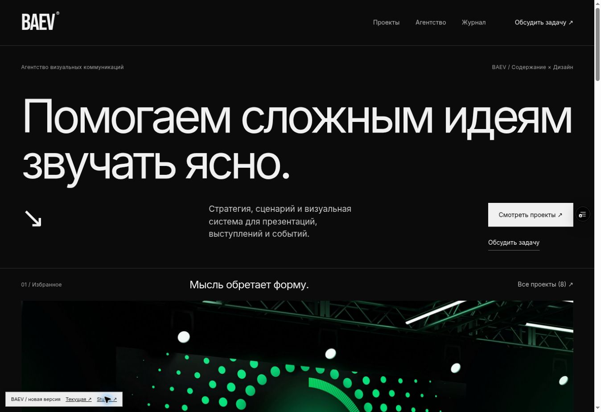
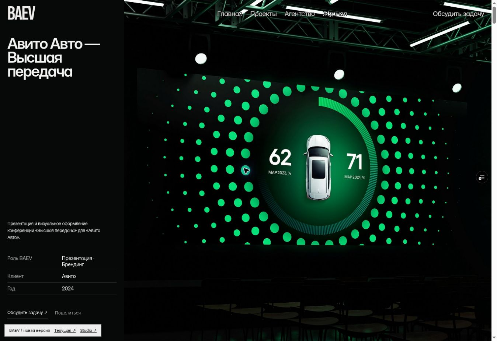

# BAEV Public V3 — отдельная версия для сравнения

Дата: 5 октября 2026. Ветка: `feat/public-v3`. Основание: `docs/PUBLIC_AUDIT_2026-10-04.md`.
Исходная опубликованная версия: `feat/studio-v2`, commit `faccd3c6de29d891938e1afae9696a49869dca32`.

## Что реализовано

1. Публичные `/`, `/work`, `/work/[slug]`, `/blog`, `/blog/[slug]`, `/about`, `/contact` работают внутри CMS-приложения Next.js. Главная, каталог, рекомендации и журнал используют одни записи Payload. Статический Framer-экспорт сохранён для исходной версии.
2. Новая монохромная визуальная система: крупная типографика, понятное предложение, два основных перехода, избранные проекты, задачи клиента, процесс, подтверждённые клиентские названия, журнал и контактный блок. Цвет остаётся в реальных работах.
3. Каталог: категории из CMS, фильтр в URL, счётчик, роль агентства и ручной порядок. Обычная история браузера и переходы Next Link. Нет пустых декоративных фильтров.
4. Кейс: обложка остаётся без отступов и скругления, во всю правую область. Роль и аудитория доступны отдельно. Связанные проекты выбираются по пересечению категорий. Поддержаны существующий блочный и внешний iframe-сценарии с сохранением информации слева.
5. Три существующие статьи перенесены с прежними slug, реальным автором и датой. Удалён служебный SEO-список, короткие заголовки превращены в разделы, длинный вводный заголовок — в обычный абзац. Сохранены текст, ссылки, списки и выделения. Скрипт `cms/scripts/extract-legacy-articles.mjs` делает перенос воспроизводимым. Три отсутствовавшие статьи не выдуманы.
6. Журнал: заголовок и лид перед содержимым, автор, дата, время чтения, раскрывающееся оглавление, якоря, переход к проектам. Редактирование и публикация в Studio.
7. Агентство: объяснение подхода, этапы, результаты этапов и границы сотрудничества. Неподтверждённые карточки команды, награды и показатели не добавлены.
8. Контакты: форма в первом экране, имя/email/задача, контекст выбранного проекта, состояния загрузки/ошибки/успеха, сохранение текста, повтор с тем же ключом. Серверная уникальность ключа защищает от дублирования заявки, хеш содержания не допускает незаметного изменения запроса с тем же ключом.
9. Публикация: видимый перечень изменённых полей и блоков, отдельные обязательные ошибки и рекомендации. Роль агентства — содержательная рекомендация, а не выдуманный процент готовности.
10. Studio: четыре основных старта по задаче, библиотека по намерению, вставка без внешнего форматирования, сведения о роли/аудитории/порядке, редактирование текстов главной и агентства в настройках.
11. История: автор новых сохранений, сохранение текущего черновика перед восстановлением, проверка ожидаемой ревизии. Операции Studio сериализуются по документу PostgreSQL advisory transaction lock; устаревшая вкладка получает 409 и сохраняет свои локальные правки. Эта гарантия относится к маршрутам Studio; прямые административные/интеграционные записи должны проходить такую же координацию.
12. Медиатека: связи с текущими черновиками, предупреждение о большом видео, сохранённые alt/теги/авторство. Связи ограничены первыми 500 документами каждого типа и помечаются как неполные при превышении. История и опубликованная версия могут содержать дополнительные ссылки.
13. Общие свойства: 404, повтор после ошибки страницы, клавиатурная навигация, видимый фокус, мобильное меню, reduced motion, локальные шрифты, адаптивные изображения и существующее управление видео. Canonical, sitemap/robots и метаданные; comparison-развёртывание noindex.
14. Измерение: типизированные события `baev:analytics` и Web Vitals через `baev:vitals`. Они не отправляют персональные данные или запросы в стороннюю аналитику. Постоянный сбор не включён без выбранной системы и условий обработки.

## Изоляция сравнения

Новая база `baev_public_v3` находится на существующем Neon-подключении. Рабочая `neondb` не изменялась: из неё прочитаны контент и редакторский аккаунт. Пользователь может войти прежними учётными данными. Сессии не копировались. Заявки, сделки, компании CRM и активности не переносились. Webhook и идентификатор аналитики в копии сброшены.

Сервер в этой ветке по умолчанию работает в comparison-режиме и принудительно выбирает отдельную базу. `BAEV_COMPARISON=0` — явное переключение при последующем согласованном запуске; сейчас его не использовать. Превью не назначается на существующие production-алиасы.

Исходная медиатека помечена `sourceProtected`: её исходники нельзя удалить или заменить файлом в новой версии. Описания меняются только в отдельной БД. Новые загрузки используют случайные имена/ключи Blob. Это сохраняет работоспособность старого сайта при редактировании новой версии. Копия файлов не дублирует весь объём Blob.

Форма новой версии создаёт лиды только в новой базе, без внешнего webhook; это прямо обозначено пользователю формы. Для production-переключения надо перенести только нужные новые изменения контента, согласовать обработку заявок и выбрать основной адрес — простое изменение алиаса не решает редакционное объединение двух баз.

## Что нельзя достоверно завершить без материалов команды

- Авторские разборы до/после, подтверждённые результаты, отзывы, точные роли и согласованные портреты. Структура готова; реальные факты нельзя заменить демонстрационными цифрами.
- Полноценная редактура всех кейсов: два старых кейса содержат повторяющиеся общие формулировки, другие пока преимущественно визуальные. В копии исправлены подтверждённые опечатки и краткие описания; отсутствующие проектные обстоятельства не сочинялись.
- Три ранее отсутствовавшие статьи: нужен исходник либо работа автора. Для реальных трёх статей основной текст мигрирован; декоративные фотографии из старого экспорта не выдаются за изображения кейсов.
- Реальный внешний кейс: нужен точный URL страницы и, для высоты без второго скролла, доступ к установке `postMessage`-скрипта на источнике. Ручная высота и переход к оригиналу работают без доступа к источнику. Внешний сайт может запрещать iframe своими заголовками.
- Согласованные сведения об операторе данных и юридический текст. В интерфейсе объяснена цель полей; вымышленных юридических реквизитов нет.
- Пользовательские интервью, Safari/физические устройства, реальные LCP/INP/CLS и конверсия. Успешная сборка не является их измерением.
- Постоянный мониторинг, маршрутизация реальных обращений и ретеншн резервных копий требуют выбранной инфраструктуры. Новая версия не отправляет тестовые уведомления в рабочие каналы.

## Проверка и продолжение

Первый полный проход: 77 интеграционных проверок, TypeScript и production-build пройдены. Проверяются сохранность обложки/iframe, черновики/публикация, формы и поведение при ошибках. Итоговые ручные проверки опубликованной версии и её URL фиксируются ниже после развёртывания.

### Опубликованная версия и ручная проверка

- Ветка GitHub: `https://github.com/IMONsergey/bupd/tree/feat/public-v3`.
- Адрес ветки: `https://baev-cms-git-feat-public-v3-cdo-2844s-projects.vercel.app/`.
- Первая проверенная сборка: `https://baev-6er54j53y-cdo-2844s-projects.vercel.app/`, Vercel READY, commit `5637d37`.
- Исходный сайт: `https://baev-case-lab.vercel.app/`; исходная CMS: `https://baev-cms.vercel.app/`. Оба адреса после публикации новой ветки сохранили commit `faccd3c`.
- В браузере проверены главная, каталог, фильтр «Веб» (2 результата и категория в URL), возврат к работам, кейс Авито, переход из кейса к форме с контекстом, журнал и статья с 21 якорем оглавления.
- Обложка Авито: x=340, y=0, ширина=1008, высота=936 при высоте окна 936; padding=0, border-radius=0. Битых изображений на этой странице нет. Это проверка конкретного desktop-окна, а не обещание проверки всех устройств.
- HTTP-проверка основных страниц и трёх статей: 200 и noindex. robots запрещает индексацию, sitemap пуст. Для неизвестных адресов добавлен маршрут к собственной странице 404 вместо системной заглушки Next.js.
- Валидация формы переводит фокус на первое обязательное поле. Успешная отправка подтверждена интерфейсом и отдельной БД. Повтор одного запроса: 200 и один лид/одна задача; изменённое содержимое с прежним ключом: 409; некорректный email: 400; honeypot: 200 без записи. Контекст кейса сохранён. Созданные проверкой записи удалены из тестовой базы.
- Страница входа Studio открывается. Вход в редактор через браузер с личным паролем в этой сессии не выполнялся; редакторские сценарии проверены интеграционными тестами. Предыдущая учётная запись перенесена без изменения пароля.
- После просмотра уплотнено начало главной: медиа начинается раньше. Пустые обложки журнала заменены текстовыми карточками, логотип и пункты меню унифицированы, одинаковые роль/категории в кейсе не повторяются. Ожидание блокировки документа ограничено 5 секундами, чтобы конкурирующие сохранения не удерживали соединения бесконечно.

Перед переносом этой ветки на основной домен обязательны редакционное согласование фактов, реальный iframe-источник и проверка целевых устройств. Это следующие проверяемые действия, а не скрыто выполненные пункты.

### Итоговая сборка

Код `c05e648` опубликован и проверен: `https://baev-d9765ghrf-cdo-2844s-projects.vercel.app/`, Vercel READY. Первый проект начинается на y=683 при высоте окна 936; горизонтального переполнения и битых изображений на главной нет. Неизвестный URL возвращает 404 с собственной страницей BAEV. После финального просмотра навигация над фото/видео получила затемняющий градиент для читаемости на светлых участках; размеры обложки не менялись.

Снимок кейса фиксирует сохранённую геометрию обложки и упрощённый паспорт (до добавления градиента навигации):

