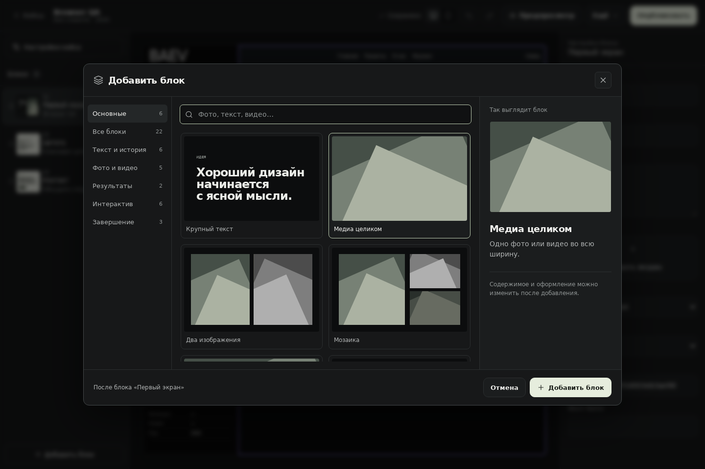
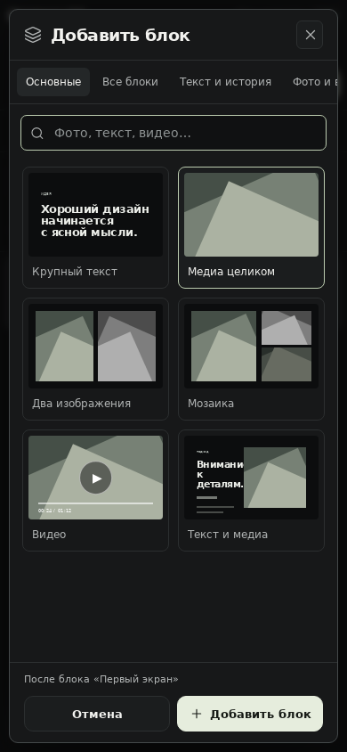

# Тёмная BAEV Studio

Работа продолжена от `abad784` в `feat/studio-v2`. Предыдущий аудит восстановил контент и серверные операции; этот этап заменяет светлый интерфейс самостоятельной тёмной Studio.

## Изменения

- Общие графитовые поверхности, спокойные состояния, читаемые подписи, единые формы, карточки и диалоги для всех разделов. Декоративные лозунги и демонстрация дизайн-системы убраны из рабочих экранов.
- Каталог 22 блоков: шесть основных, категории, поиск, разные миниатюры компоновки, предварительный просмотр выбранного блока и явное место вставки. Стрелки переключают результаты, Enter вставляет блок, Escape закрывает окно.
- Редактор: холст, список блоков и настройки доступны на телефоне через три вкладки; на десктопе видны одновременно. История и ручное сохранение перенесены в «Ещё»; автосохранение и публикация остаются в верхней панели.
- Иконки Studio используют `morphicons/react` с настоящими переходами состояний. `TransitionPanel` адаптирован из Motion Primitives. Поиск и разделение выбора/вставки ориентированы на Command Search Spectrum UI. Спокойная плотность и состояния элементов ориентированы на SmoothUI. Полные библиотеки демонстрационных блоков не добавляются в продукт.
- `MotionConfig reducedMotion="user"`, Morphicons и переход панели учитывают системное уменьшение движения.
- Диалоги изолируют фон через `inert`, удерживают фокус и возвращают его при закрытии. Ошибки входа, создания и копирования кейса оставляют форму доступной для повтора.

Payload, коллекции, версии, политика доступа, опубликованные документы и исходный публичный renderer не изменены. Тема Studio не попадает в отдельный layout публичного кейса. Миниатюры показывают структуру блока; действительный контент виден на холсте.

## Проверки

| Проверка | Результат |
|---|---|
| Production build + TypeScript | Пройдены |
| ESLint всего CMS | 0 ошибок; 27 предупреждений, преимущественно существующие миграции и техническая админка |
| Регрессии документа, истории, доступа, CRM, публикации и нового каталога | 20 проверок в 6 файлах пройдены |
| Настоящий HTTP API Next/Payload на отдельной SQLite | 17 сценариев пройдены: создание, сохранение, связи, публикация, приватные поля, восстановление, снятие с публикации |
| Настоящий браузер + production Next/Payload | Вход, шесть разделов, создание кейса, вставка, автосохранение и сохранность после перезагрузки; десктоп 1440 и телефон 390; без ошибок исполнения и горизонтальной прокрутки |
| Изолированный браузерный сценарий с исходным Avito | 36 → 37 блоков, undo/redo, синхронизация iframe, поиск, закрытие и восстановление фокуса; восемь карточек. API в этом сценарии подменён, поэтому он проверяет интерфейс и preview, а не БД |

Тестовые HTTP-документы удалены. Тесты выполнялись на отдельной локальной базе, не на production PostgreSQL. Скриншоты ниже сделаны на настоящей production-сборке Next с тестовым кейсом.

## Развёртывание

На момент аудита `baev-cms` опубликован с `68a7bd7`, не привязан к репозиторию GitHub и ранее развёртывался через CLI. `baev-case-lab` связан с репозиторием. Отправка коммита в GitHub сама по себе не обновляет существующий CMS. Для публикации нужно развёртывание **существующего** `baev-cms` с рабочей веткой и корнем `cms`, сохраняя текущие PostgreSQL/Blob/секреты. Эта запись не утверждает, что новая версия уже опубликована.

Git-привязка `baev-cms` к `IMONsergey/bupd` восстановлена 4 октября. Корень проекта — `cms`, установка — `npm ci`, сборка — `npm run ci`, Node 22. Основная ветка Vercel пока `main`, где сохранён статический сайт; CMS находится в `feat/studio-v2`. Для этого выпуска запускается Git preview рабочей ветки с последующей проверкой и promotion в существующем проекте. Данные PostgreSQL, Blob и переменные окружения сохранены.
