# BAEV Studio — отступы и цельный рабочий процесс

4 октября 2026. Ветка `feat/studio-v2`. Продолжение `fa0bbab`.

## Что изменилось

- Единый ритм между сценами: по 12 px сверху и снизу на компьютере, по 8 px на экранах до 809 px. Два обычных соседних блока дают 24 / 16 px. Настройка действует в конструкторе, приватном предпросмотре и публичной странице.
- Три независимые галочки в верхней части настроек блока: **Без скругления**, **Без отступа сверху**, **Без отступа снизу**. Применяются к кейсам и статьям, сохраняются в шаблонах и версиях. «Без скругления» касается изображений, видео и их обрезающих контейнеров только внутри этого блока.
- Выбранный блок открывается кнопкой **Блок** в верхней строке или через его контекстную панель. Галочки не спрятаны во вкладке оформления.
- Блок пространства сохранён. Новая композиция пространства — 40 px, тонкая линия — 24 px. Дополнительные средние и большие интервалы остаются доступными. Явные настройки существующих документов не переписываются.
- Кнопка замены медиа перенесена из центра кадра в угол: клик по центру выбирает блок и не открывает медиатеку случайно.
- Рабочий стол показывает шесть последних кейсов и статей, даёт два прямых действия создания. Сводка компактная; CRM и задачи ниже материалов. Вместо повторяющихся карточек статистики — короткие строки.
- Каталоги кейсов и статей: четыре основных фильтра, остальные в списке; очистка поиска и общий сброс; единый статус материала. Действия карточек появляются при наведении / фокусе и всегда доступны на сенсорных экранах. Карточки выводятся по 24 с «Показать ещё»; серверные выборки больше не обрываются на 200 записях.
- Создание: обязательное название и готовая структура. Клиент / автор, год и категории раскрываются по желанию. Enter в названии создаёт материал. Все пять структур кейса помещаются в один ряд на большом экране.
- Публикация: обязательные исправления остаются видимыми, рекомендации и вид в поиске раскрываются по необходимости. Исправлены русские формулировки.
- Облегчены общие навигация, заголовки, границы и карточки. Сохранены монохромная палитра, Morphicons, Motion и публичный язык BAEV.

## Исследование практик

Изучены актуальные официальные инструкции; это исследование документации, а не аудит закрытых аккаунтов конкурентов.

| Источник | Описанный подход | Применение в BAEV |
| --- | --- | --- |
| [Tilda: мобильная версия](https://help.tilda.cc/mobile-version) | Раздельные верхний и нижний отступы, настройки скругления и проверка устройств | Общий небольшой интервал, независимые исключения, проверка публичного и редакторского рендера |
| [Framer: on-page editing](https://www.framer.com/help/articles/on-page-editing/) | Редактирование видимого контента на странице, доступ к остальным полям отдельно, публикация после изменений | Выбор и редактирование на холсте, дополнительные поля по необходимости, черновик отдельно от публикации |
| [Webflow: page building](https://help.webflow.com/hc/en-us/articles/33961210206483-Page-building) | Готовые структуры и компоненты, перестановка и настройка без построения всего с нуля | Короткое создание материала и библиотека готовых блоков |

Конкретные размеры, вид дашборда и организация фильтров — решения для BAEV на основе запроса Сергея и проверенного рабочего процесса.

## Экраны и проверка пути

Снимки сделаны в этой итерации на локальной копии с изолированной базой и тестовыми материалами. Серый прямоугольник — настоящий односекундный MP4 для проверки видео, а не поломанный плеер.

| Шаг | Проблема исходного экрана | Результат |
| --- | --- | --- |
| 1. Рабочий стол | Семь крупных карточек статистики оттесняли материалы, статьи отсутствовали | Единая лента последних кейсов и статей, компактная сводка; переходы проверены |
| 2. Каталог | Восемь одновременно видимых фильтров и дублирующиеся подписи карточек | Четыре основных фильтра, дополнительные по запросу; поиск, URL и сброс проверены |
| 3. Создание | Дополнительные поля перед выбором структуры, пятая структура уходила ниже | Одно обязательное поле, подробности свёрнуты; создание Enter и кнопкой проверено |
| 4. Редактор | Разный ритм секций, исключения отсутствовали, замена медиа перехватывала клик | Три явные галочки и одинаковые интервалы; сохранение, отмена и повтор проверены |
| 5. Публикация | Второстепенные рекомендации конкурировали с основным действием | Компактное окно, исправления по приоритету; публичная версия проверена |
| 6. Телефон и остальные разделы | Нужно было проверить всю оболочку, а не один холст | Рабочий стол, каталог, создание, блог, медиатека, CRM, сделки и помощь помещаются в 360 px |

### До изменений

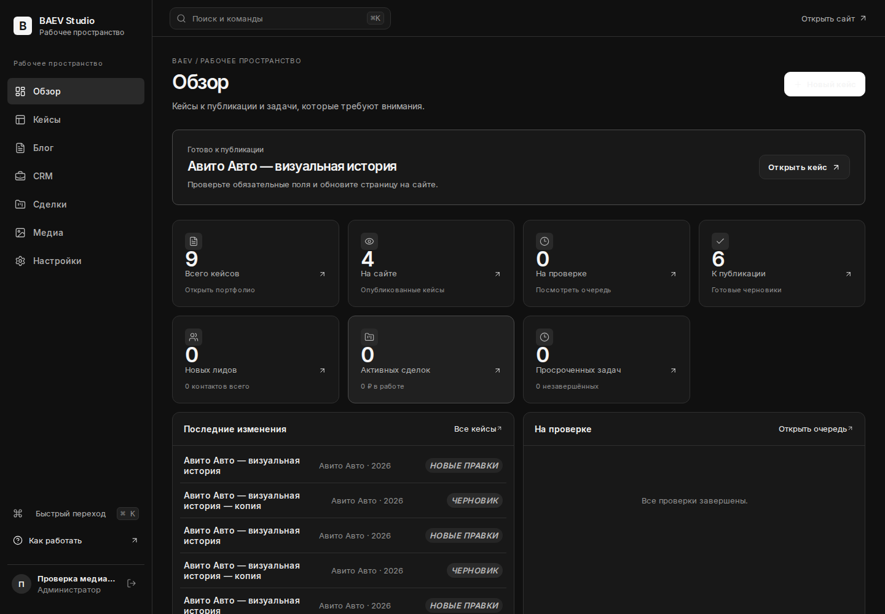
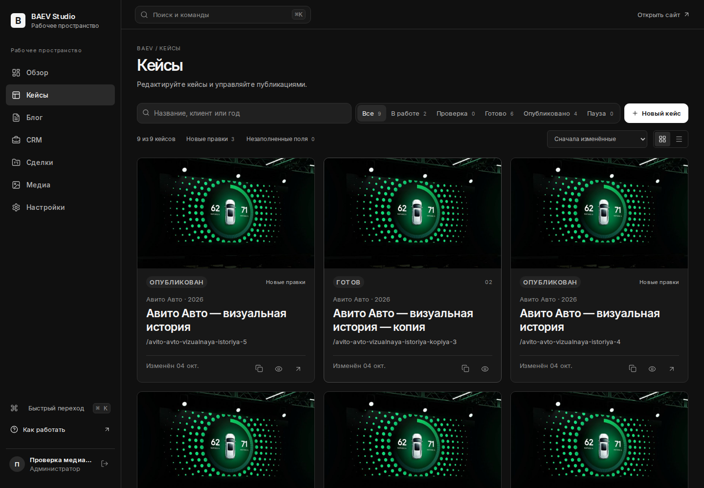
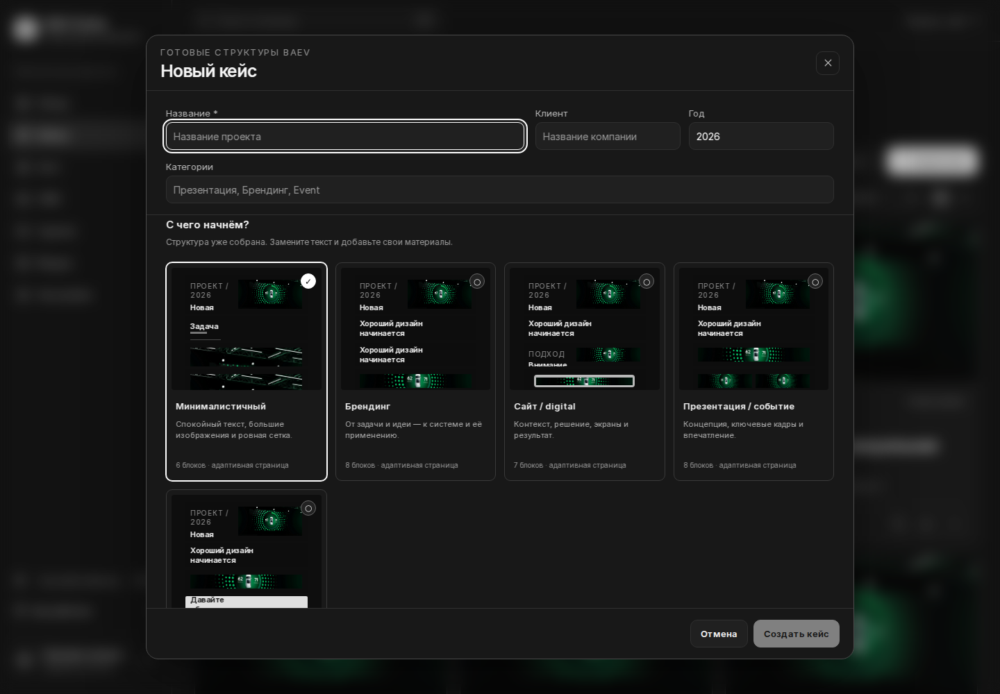

### После изменений

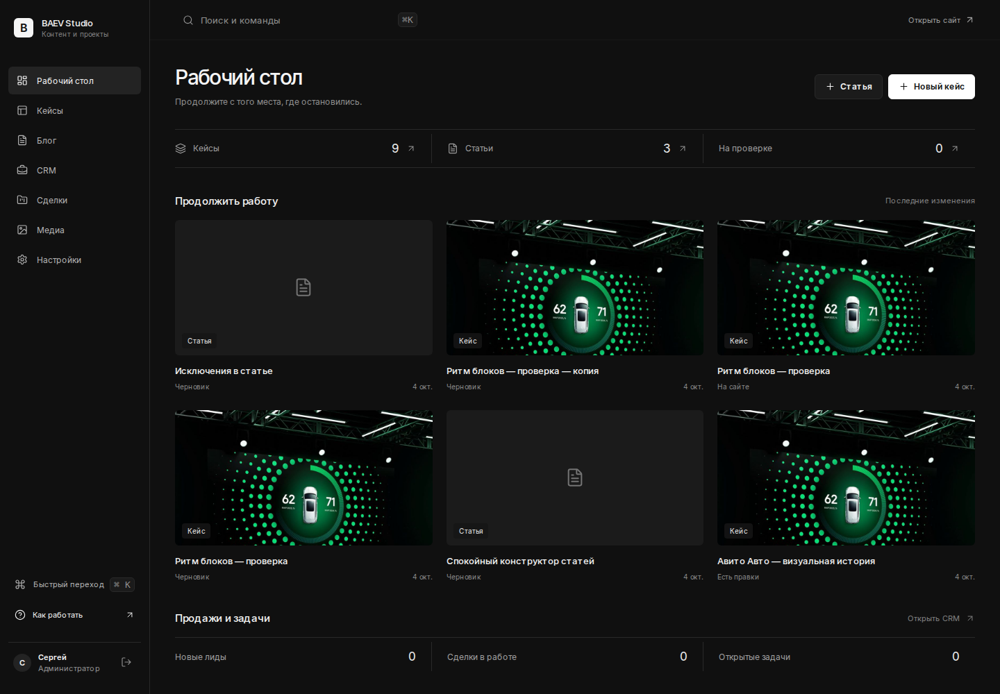
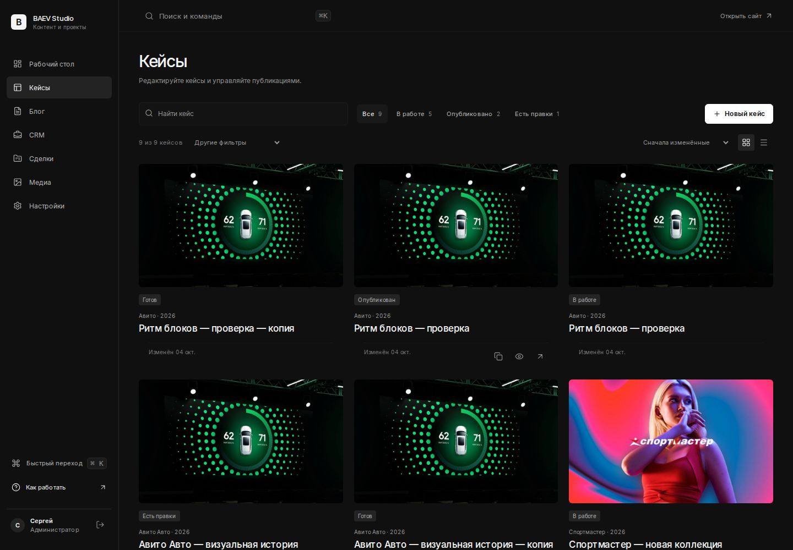
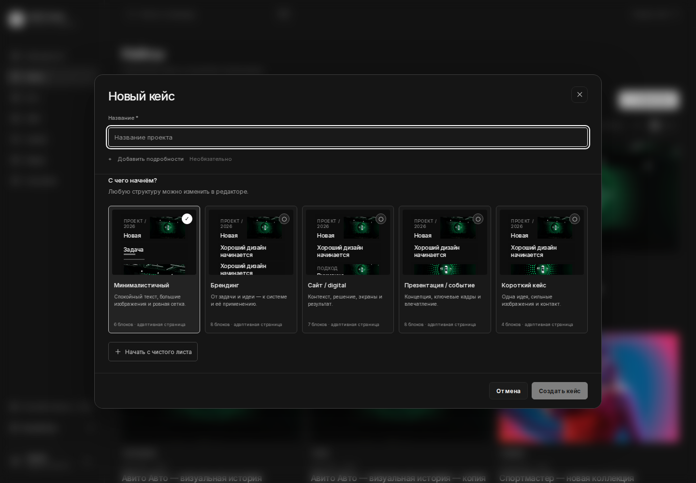
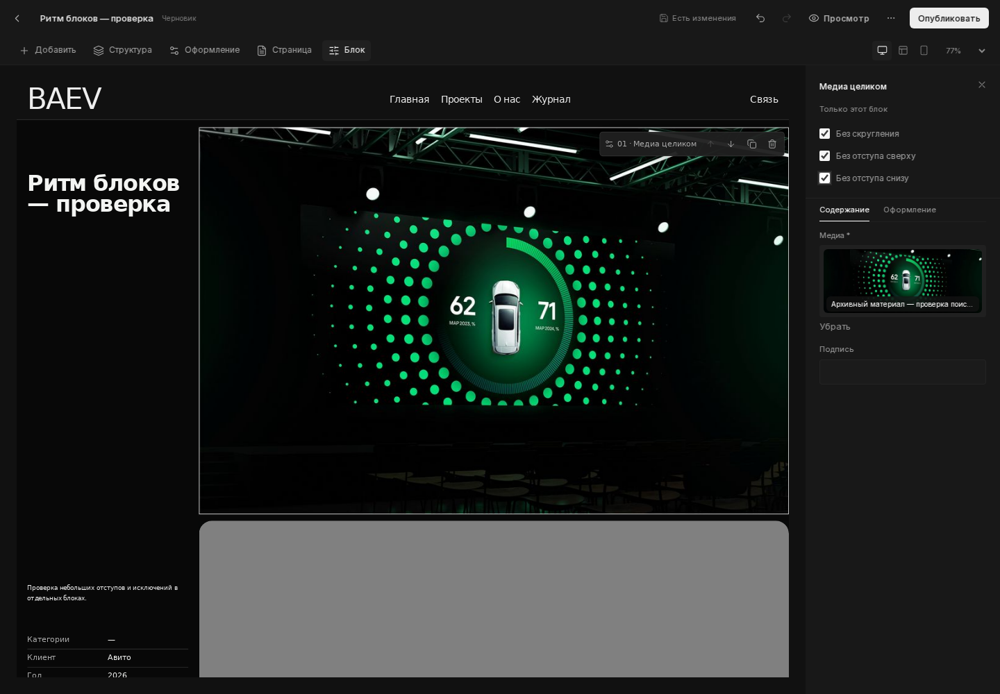
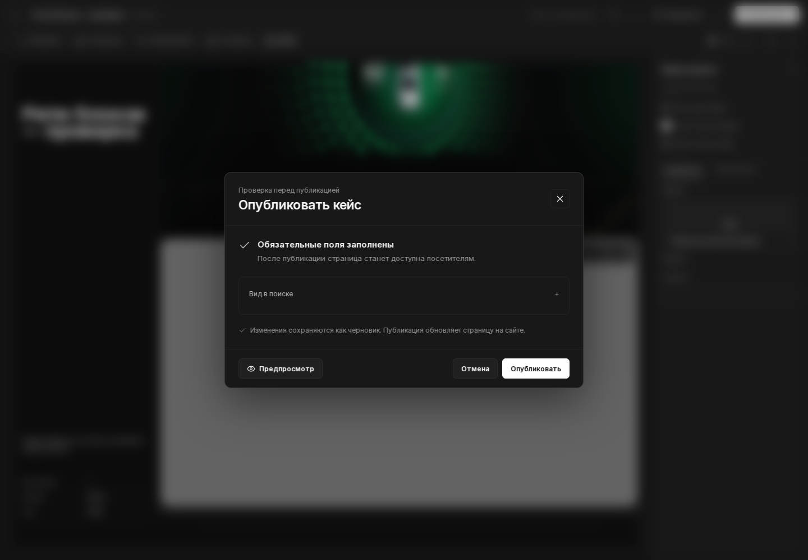
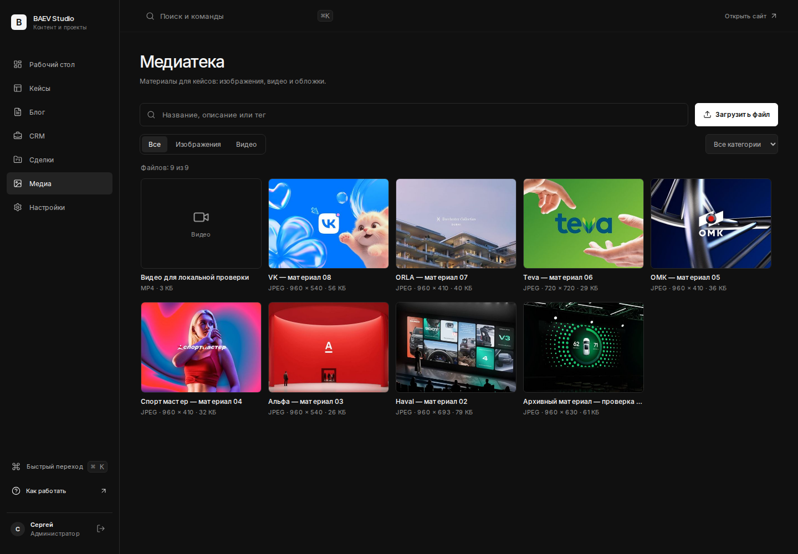
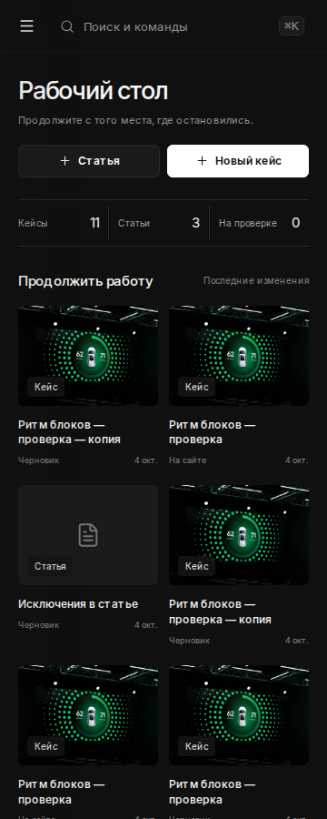
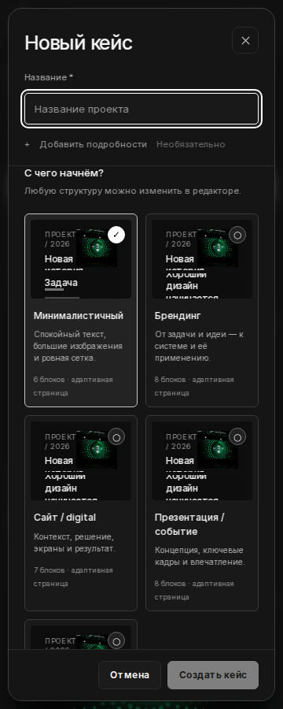

## Проверки

- Production build и TypeScript — успешно.
- 49 интеграционных тестов в 13 наборах — успешно. После последних изменений создания и публикации повторены соответствующие 15 тестов — успешно.
- 12 браузерных регрессионных сценариев: холст, библиотека, inline-редактирование, фон и скругление, undo/redo, сохранение, публикация, разделение черновика и сайта, копия, сброс, адаптивность и статьи — успешно.
- 9 новых сквозных сценариев Chromium: рабочий стол; поиск и фильтры; создание по названию и точный интервал 24 px; независимость галочек, reload и undo/redo; нулевой стык блоков и радиус видео; публикация и копия; размеры 360 / 390 / 768 / 1024 / 1440; галочки в статье; отсутствие runtime-ошибок — успешно.
- У опубликованной страницы дополнительно проверен отступ 8 px с каждой включённой стороны на телефоне. Снятие нижнего отступа у первого блока и верхнего у следующего даёт точно 0 px.
- Миграции: все шесть UP последовательно исполнены в PostgreSQL WASM (PGlite). Новая миграция `20261004_142135_baev_block_spacing` добавляет 402 nullable boolean-колонки с default false и меняет только значения по умолчанию интервалов. В UP нет DROP, DELETE, TRUNCATE или переписывания пользовательских записей. Порядок и состав enum сохранены.
- ESLint изменённых компонентов — 0 ошибок. У VisualCaseBuilder остаются четыре прежних предупреждения о зависимостях эффектов.
- Скриншоты не доказывают полное соответствие WCAG. Проверены нативные checkbox, фокус, клавиатурное создание, доступность действий карточек через фокус и отсутствие горизонтального обрезания модального окна на 360 px.

## Технические заметки

- Поля общие: `squareMedia`, `flushTop`, `flushBottom`. UI: `BlockPresentation.tsx`. Данные и CSS работают без редактирующей оболочки.
- Не добавлять отдельный spacer между каждой парой блоков. Не возвращать прежние независимые вертикальные padding секций поверх общего интервала.
- Контентная внутренняя композиция специальных блоков, например высота hero или интервалы колонок, остаётся отдельным параметром от межблочного расстояния.
- API и роли сохранены. В рабочую базу тестовые записи не добавлялись.
